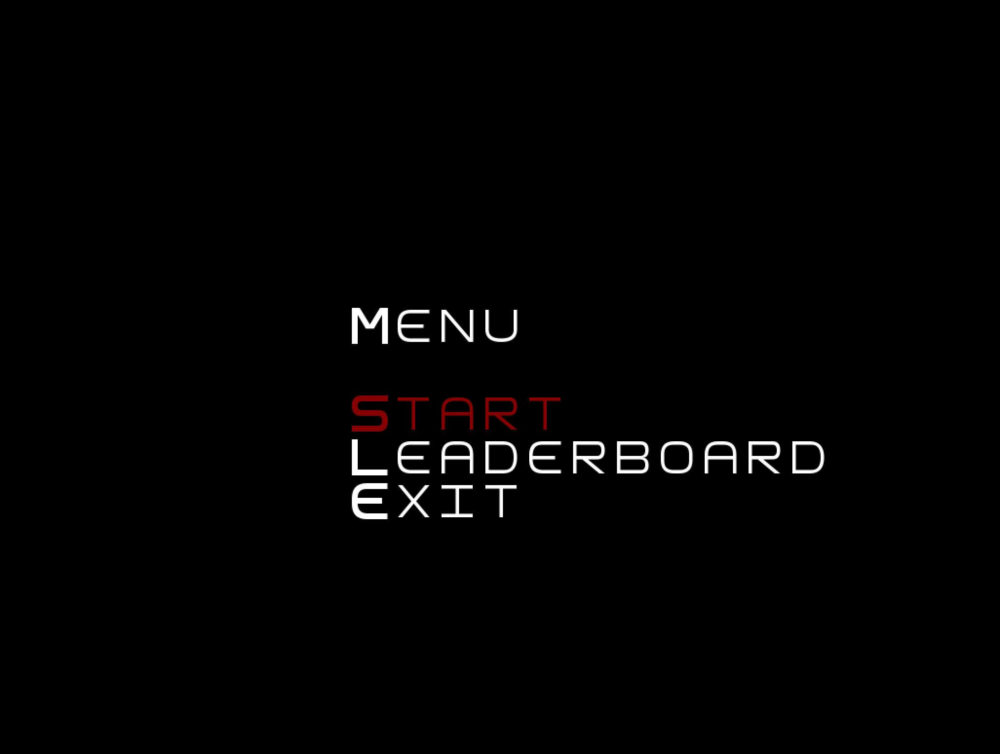
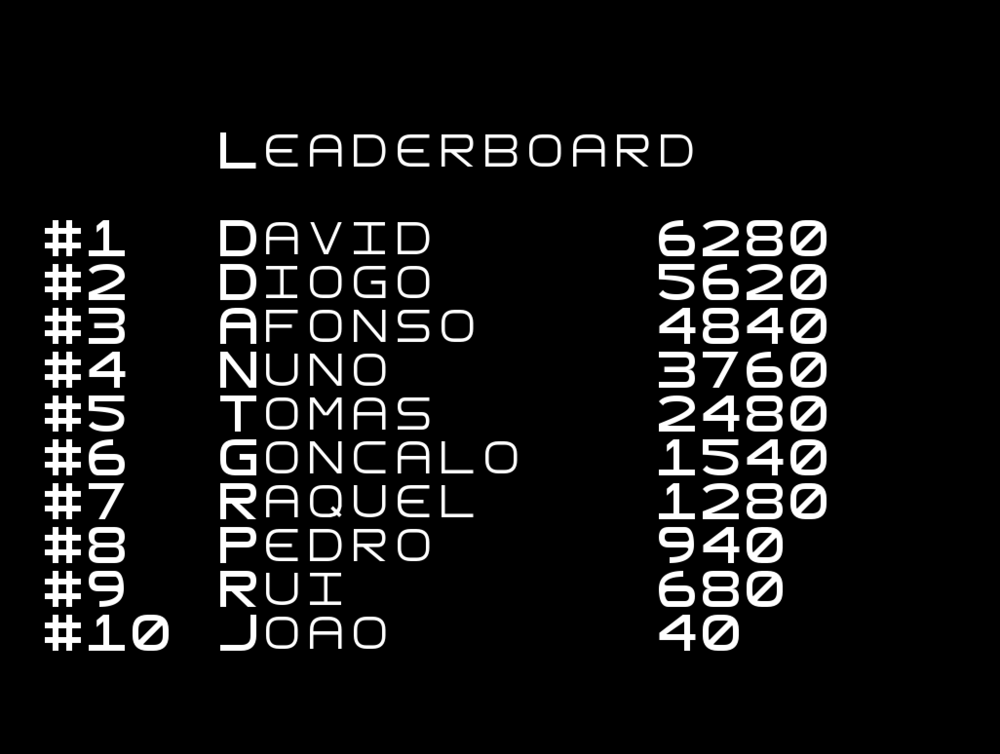
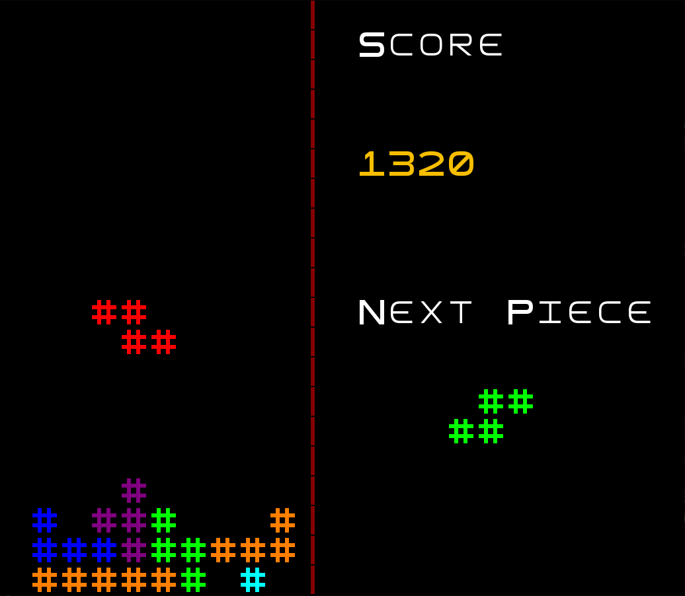
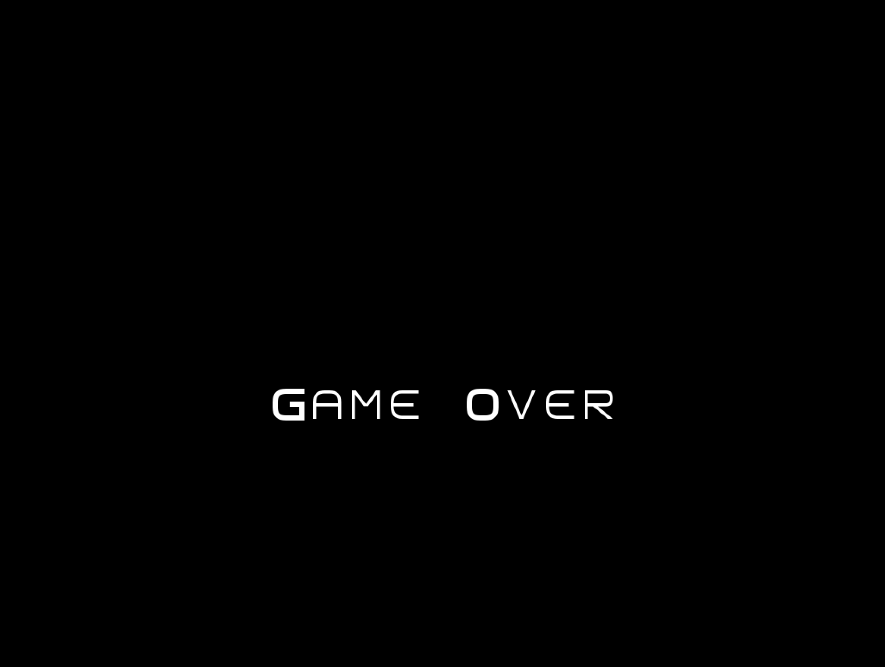

# LDTS_L02Gr05 - Tetris Ascii

## Group elements

| Name                   | Number    | E-Mail               |
| ---------------------- | --------- | -------------------- |
| David Cordeiro         | 202108820 | up202108820@fe.up.pt |
| Diogo Viana            | 202108803 | up202108803@fe.up.pt |
| Raquel Reis            | 201905529 | up201905529@fe.up.pt |

## Table of contents
1. [How to Play](#how-to-play)
2. [Implemented Features](#implemented-features)
3. [Gameplay](#gameplay)

## How to Play

The game starts with a tetromino spawning on the top center of the screen and falling automatically. You
can then move the pieces by pressing `Arrow Left` and `Arrow Right` and rotate them by using `Arrow Up` or 'Z'. The tetrominos fall at a certain rate, but you can make them fall faster by pressing
`Arrow Down` or even drop them instantly by pressing `Enter`. The objective of the player is to fill in rows,
increasing their score as much as possible, in oreder to earn a place in the leaderboard.

(**Report**) For a more detailed version of this description click [here](docs/Relatorio.md).

### Controls
#### Game:
- `Arrow Up`  - Rotate clockwise
- `Z` - Rotate counter-clockwise
- `Arrow Left`  - Shift to the left
- `Arrow Right` - Shift to the right
- `Arrow Down`  - Shift down
- `Enter` - Drop down
- `Q` - Exit to menu

#### Menu:
- `Arrow Up`    - Select above option
- `Arrow Down`  - Select down option
- `Enter` - Select current option

## Implemented Features

- [x] Menu
      - Start, Leaderboard and Exit;
- [x] Game Over Screen
      - Input Username;
- [x] Game Board
      - Current Tetromino, Tetrominos Placed;
- [x] Stats Panel
      - Current Score, Next Tetromino Spawning;
- [x] Background Music and Sound Effects

## Gameplay

