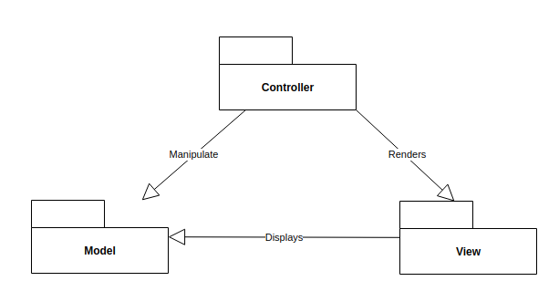
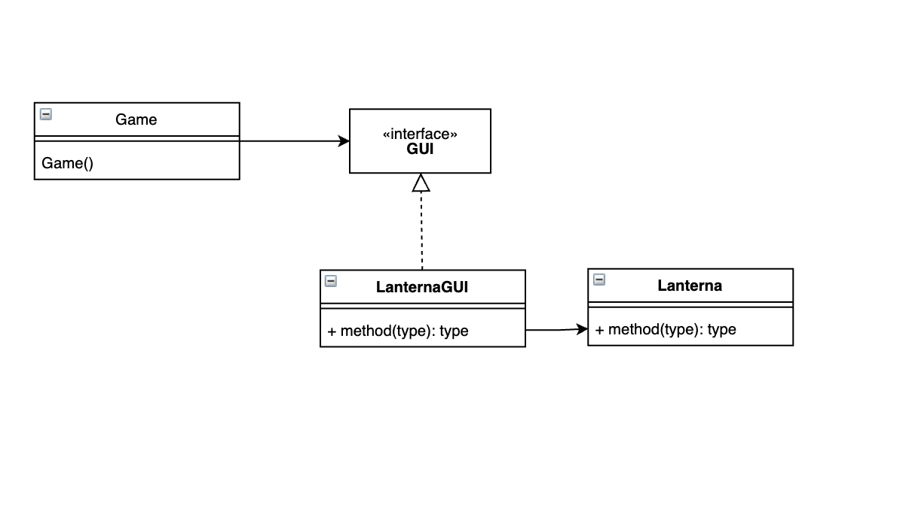

# LDTS_L02GR05 - TETRIS ASCII

## GAME DESCRIPTION

Tetris ASCII is a classic version of the popular puzzle game, entirely drawn using only ASCII characters.
The game features a menu with three options: "START" begins a new game, "LEADERBOARD" allows the player to view the top 10 high scores, and "EXIT" quits the game.
As in the original Tetris, the player can rotate and move the falling tetrominoes to try to create horizontal lines without gaps.
The score panel displays the player's current score, which is updated whenever a line is completed and disappears, as well as the next tetromino that will appear.
The player can clear up to a maximum of 4 lines at the same time (a tetris), and the more lines they are able to clear at once, the greater the increment to their score.
At the end of the game, the player is prompted to enter their username, which is then added to the leaderboard if it ranks in the top 10 scores.

This project was developed by David Cordeiro (up202108820@fe.up.pt), Diogo Viana (up202108803@fe.up.pt) and Raquel Reis (up201905529@fe.up.pt) for LDTS 2022/2023.

## IMPLEMENTED FEATURES
- **Menu** - A menu with options to Start the game, check the Leaderboard or Exit the program.
- **Leaderboard** - A simple list that shows the names of the top 10 ranked players and their respective scores.
- **Pieces** - We used the 7 classic tetris pieces, with distinct shapes and colors.
- **Piece Generation** - Pieces are generated in bags of 7 distinct shapes, with a random order each time. This ensures the least possible amount of repeated pieces for any 7 piece sequence.
- **Piece movement** - Pieces can be shifted left, right and down. For every update of the game, the piece is subjected to a down movement, representing its fall. Pieces can also be rotated clock and counterclok-wise.
- **Fallen Blocks** - The group of Blocks that have already landed.
- **Piece Landing** - When a Piece lands, it "desintegrates" in its different blocks, which are then added to the group of fallen blocks. A new Piece is then spawned.
- **Line Clearing** - After a Piece lands, the game checks if any lines of blocks with the width of our board have been formed and, if that's the case, those blocks are moved, and all blocks aboved them are shifted down accordingly.
- **Scoring** - When a line is cleared, the player score is incremented. The increment is bigger, the greater the amount of lines cleared at the same time is (1 line +40, 2 lines +100, 3 lines +300, 4 lines +1200).
- **Revealing the next piece** - Every time a new Piece is spawned, the Piece to be spawned next is determined.
- **Stats Panel** - A simple Panel that helps the player keep track of his current score and shows him what the next Piece is.
- **Losing the game** - The Game is only lost once a Block hits the top of the Board.
- **Game Over Screen** - After the Game is lost, a simple Game Over message is displayed to the Player.
- **Storing the player's username** - While the Game Over screen is shown, the Player is prompted to write his username on the terminal.
- **Exiting** - A Player can go back to the Menu mid-Game, if so, his username and score are not stored.
- **Music/Sound** - There are 3 musical tracks used in each state, as well as sound-effects for when a line is cleared and when the game is lost.

## PLANNED FEATURES
- **Pause/Continue** - Allows the player to temporarily pause the game and resume it later.
- **Combos** - A scoring technique in which the player clears multiple lines in quick succession.
- **Piece Holding** - A feature that allows the player to temporarily store a piece for later use.
- **Piece Ghosting** - A visual aid that shows the player where the falling piece would land if it were to be dropped at its current position.
- **Lock delay** - A feature that adds a brief period of time after a piece has landed before it becomes "locked" in place, allowing the player to make slight adjustments to its position or orientation before it is locked. This can be helpful for making precise placements or setting up combos.

## Design
### General Structure
#### Problem in Context:
One of the primary considerations in our project was the structure of the game. Since our game involves a GUI and is divided into different states, we considered a few specific design patterns to best meet our needs.

#### The Pattern:
We employed two main design patterns in our project: the Model-View-Controller (MVC) architectural pattern, which is traditionally used in GUI development, and the State Pattern, a behavioral design pattern that allows an object to alter its behavior based on its internal state.

#### Implementation:
In terms of implementation, we have classes that store data (models), classes that control the logic of the game (controllers), and classes that are responsible for rendering the game on the screen (viewers). These types of classes interact with each other in the following manner:

As for the different states, they are also integrated with our MVC components (each of our states has its respective model, view and controller), which allows the game to alter its behavior in a simple and efficient manner.

#### Consequences:
The use of these patterns in our design has provided the following benefits:

- The various states (Menu, Leaderboard, Game) are explicit in the code, rather than relying on a series of flags.
- The code is well organized, following the Single Responsibility Principle.
- It is easy to add new features during the development stage.

### Facade Pattern for GUI Implementation
#### Problem in Context:

In our project, we wanted to create a well-structured and easily modifiable codebase. We used the lanterna library to display the game and handle user input, but this library has a large number of functions that we don't need for our project. Using methods from the lanterna library directly would violate the Interface Segregation Principle (ISP), as it would require us to depend on interfaces we don't use. Additionally, using the raw library would result in the main high-level modules of our game (like the Application class, where the library is used to create the terminal and screen) directly depending on a low-level module, violating the Dependency Inversion Principle (DIP). To address these issues, we decided to implement a interface using the Facade pattern.

#### The Pattern:

The Facade pattern provides a simple interface to a complex subsystem with many components, allowing us to include only the features that are relevant to our needs. This helps us isolate the code from the complexity of the subsystem, promotes testability and replaceability, and allows us to expand the functionality of lanterna while still adhering to the ISP.

#### Implementation:

These classes can be found in the following files:
- [Application](../src/main/java/com/ldtsproject/tetrisascii/Application.java)
- [GUI](../src/main/java/com/ldtsproject/tetrisascii/gui/GUI.java)
- [LanternaGUI](../src/main/java/com/ldtsproject/tetrisascii/gui/LanternaGUI.java)

#### Consequences:

The use of the Facade pattern in our design has several benefits, including:

- Isolating the code from the complexity of the subsystem.
- Promoting testability and replaceability.
- Expanding the functionality of lanterna while also adhering to the Interface Segregation Principle.

### Singleton Pattern
(We also used this pattern for the maintenance of the leaderboard information throughout the execution of the program. The reasons why should be considered the same)
#### Problem in Context:
In our Tetris game, we wanted to have a class that could manage and control music and sound effects throughout the code. However, we also wanted to ensure that there was only one instance of this class, to avoid any conflicts or inconsistencies.

#### The Pattern:
To meet these requirements, we decided to implement the Singleton pattern in our Sound class. This allowed us to create a single instance of the class and provide a global point of access to it through a static method.

#### Implementation:

To implement the Singleton pattern in our Sound class, we followed the steps below:

- We made the constructor of the class private, to prevent other classes from creating instances of it.
- We created a static instance of the class and set it to null.
- We created a static method that returns the instance of the class, creating it if it does not exist yet.

#### Consequences:
The use of the Singleton pattern in our Sound class has provided the following benefits:

- It ensures that there is only one instance of the class, avoiding any conflicts or inconsistencies.
- It provides a global point of access to the instance, making it easy to use the class throughout the code.
- It allows us to control the instantiation of the class, making it easier to manage and maintain.

### Factory Pattern
#### Problem in Context:
In our Tetris game, we have different types of Tetris pieces that need to be instantiated and manipulated throughout the code. These pieces have some important differences, such as the color and the configuration of the blocks, but they also share many common operations, such as shifting, rotating, and dropping.

#### The Pattern:
To meet these requirements, we decided to use the Factory design pattern to instantiate the different Tetris pieces. We created an abstract Piece class that defined the common operations and implemented the specific differences in the subclasses, which extended the Piece class. We also created a PieceFactory class that was responsible for instantiating the different implementations of Piece.

#### Implementation:

To implement the Factory design pattern in our Tetris game, we followed the steps below:

- We created an abstract Piece class that defined the common operations and implemented the specific differences in the subclasses.
- We created a PieceFactory class that was responsible for instantiating the different implementations of Piece.
- We implemented the buildPiece method in the PieceFactory class, which consulted an enum value passed in as a parameter to determine which implementation of Piece to create.
- We made sure that the buildPiece method returned a Piece, ready to be rotated, shifted, and dropped by the player.

#### Consequences:
The use of the Factory design pattern in our Tetris game has provided the following benefits:

- It allowed us to manipulate the different Tetris pieces in a uniform way, regardless of their specific differences.
- It made it easy to add new types of pieces to the game, by simply creating a new subclass of Piece and implementing the specific differences.
- It provided a clear separation of responsibilities between the abstract Piece class and the subclasses, making the code more organized and maintainable.

## KNOWN CODE SMELLS AND REFACTORING SUGGESTIONS
#### **Large Class**
The Board and LanternaGui classes contain many fields and methods, which we believe is necessary due to the complexity of the program. The Board class, in particular, serves as the main class and contains the logic for the game mechanics. It requires a large amount of data and various methods to function properly. We believe that extracting these methods would only make the class more cluttered, rather than improving its readability.

#### **Feature envy and message chains**
As a result of using the Model-View-Controller pattern, some controllers rely heavily on calling methods from the model. This can lead to feature envy, where the controller becomes envious of the model's capabilities. Additionally, accessing certain parameters of the model often requires making a request through the controller, resulting in long chains of messages.
## TESTING

## SELF-EVALUATION

- David Cordeiro: 33%
- Diogo Viana: 33%
- Raquel Reis: 33%
